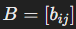

### Билет №1. Простейшие операции над матрицами: транспонирование, сложение, умножение на число. Умножение матриц. Как определить, что две матрицы можно умножить. Размер выходной матрицы.
 

1. Определение матрицы

Матрица — это таблица чисел, расположенных в строках и столбцах. Размер матрицы обозначается как 𝑚 × 𝑛, где 𝑚 — 
количество строк, а 𝑛 — количество столбцов.
  

2. Основные операции над матрицами:

 - `Транспонирование матрицы` — это операция, при которой строки исходной матрицы становятся столбцами новой матрицы, 
и наоборот. 

    Обозначение: если исходная матрица 𝐴 имеет размер 𝑚 × 𝑛, то транспонированная матрица 𝐴^𝑇 будет иметь размер 𝑛 × 𝑚.

 - `Сложение матриц`. Сложение возможно только для матриц одинакового размера (одинаковое количество строк и столбцов). 
Если  и  — две матрицы размером 𝑚 × 𝑛, то их сумма 𝐶 = 𝐴+ 𝐵 также будет 
иметь размер 𝑚 × 𝑛, и каждый элемент 

 - `Умножение матрицы на число` 𝑘 выполняется умножением каждого элемента матрицы на это число. Если  — 
матрица размером 𝑚 × 𝑛, то результат умножения .
  

3. Умножение матриц

 - `Условие умножения`. Чтобы умножить матрицу 𝐴 размера 𝑚 × 𝑛 на матрицу 𝐵 размера 𝑛 × 𝑝, количество столбцов первой 
матрицы 𝑛 должно быть равно количеству строк второй матрицы 𝐵. Если это условие выполнено, говорят, что матрицы 
согласованы для умножения.

 - `Размер выходной матрицы`. Результатом умножения матрицы 𝐴 размера 𝑚 × 𝑛 на матрицу 𝐵 размера 𝑛 × 𝑝 будет новая 
матрица 𝐶 размером 𝑚 × 𝑝.

 - `Правило умножения матриц`
Если , то элемент  в матрице 𝐶 = 𝐴 ⋅ 𝐵 определяется как сумма 
произведений элементов 𝑖-й строки матрицы 𝐴 на соответствующие элементы 𝑘-го столбца матрицы 𝐵:

  
