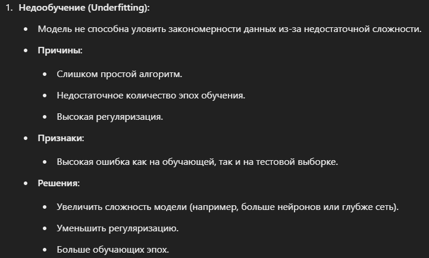
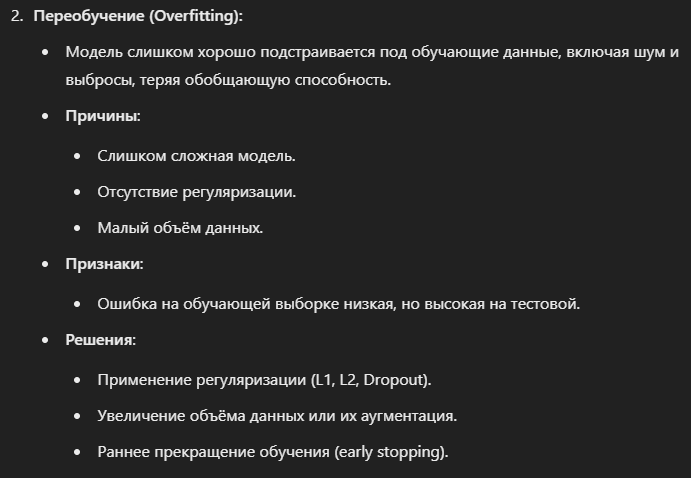
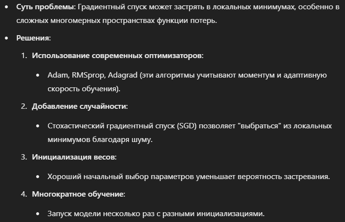
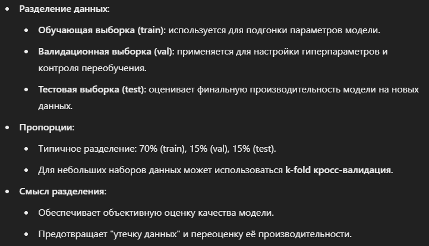
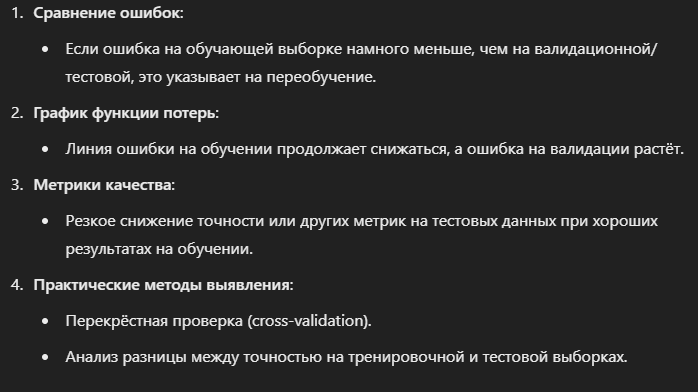

### Проблемы недо- и переобучения. Проблема локальных минимумов и ее решение. Идея разделения выборки на train, val, test. Как выявить переобучение

`Проблемы недо- и переобучения`

`Проблема локальных минимумов`

`Идея разделения выборки на train, val, test`

`Как выявить переобучение`

