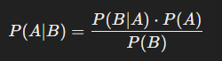

### Схема Бернулли. Теорема Байеса. Виды статистических распределений

1. `Схема Бернулли`

Схема Бернулли — это модель для анализа серии испытаний, в каждом из которых возможно только два исхода: успех или 
неудача (например, выпадение "орла" или "решки" при подбрасывании монеты). Основные условия схемы:

 - Испытания независимы (результат одного не влияет на результаты других)
 - Вероятность успеха 𝑝 в каждом испытании остаётся постоянной

Схема Бернулли часто используется для вычисления вероятности определённого числа успехов в серии испытаний. Например, 
если подбросить монету 10 раз, можно рассчитать вероятность того, что "орёл" выпадет ровно 6 раз.

2. `Теорема Байеса`

Теорема Байеса — это формула, которая позволяет пересчитывать вероятности событий с учётом новой информации. Если у нас 
есть вероятность какого-то события (например, болезнь у человека), а также вероятность получения какого-то наблюдения 
(например, положительного теста на болезнь), теорема Байеса помогает определить, какова вероятность события при условии 
наблюдения:

где:
 - P(A∣B) — вероятность события 𝐴, если известно, что произошло событие 𝐵;
 - P(B∣A) — вероятность события 𝐵, если произошло событие 𝐴;
 - P(A) — изначальная вероятность события 𝐴;
 - P(B) — изначальная вероятность события 𝐵;

Теорема Байеса особенно полезна для обновления вероятностей в условиях неопределённости, например, в диагностике 
заболеваний, где вероятности меняются по мере поступления информации.

3. `Виды статистических распределений`

 - `Равномерное распределение`

    В равномерном распределении вероятность всех событий в заданном интервале равна. Например, при броске честной 
игральной кости каждое число от 1 до 6 имеет равную вероятность.

 - `Биномиальное распределение`

    Описывает количество успехов в серии испытаний Бернулли. Например, вероятность получить определённое число "орлов" 
при 𝑛 подбрасываниях монеты.

 - `Нормальное распределение`

    В нормальном распределении (или гауссовском) большинство значений сгруппировано вокруг среднего, а вероятность резко 
убывает по мере удаления от него. Оно часто встречается в природе и социальных науках (например, распределение роста 
людей).

 - `Пуассоновское распределение`

    Описывает вероятность получения определённого числа событий за заданный интервал времени или пространства при низкой 
вероятности единичного события. Например, количество звонков в колл-центр за один час.

 - `Экспоненциальное распределение`

    Описывает время между событиями в потоке, где события происходят с постоянной средней скоростью. Например, время до 
следующего телефонного звонка.
