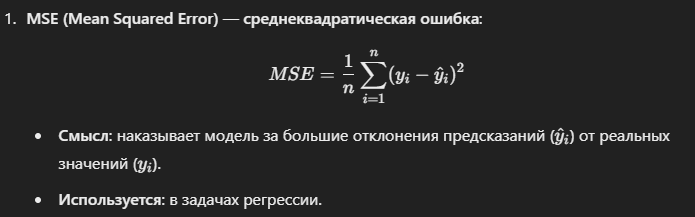
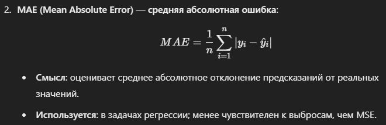
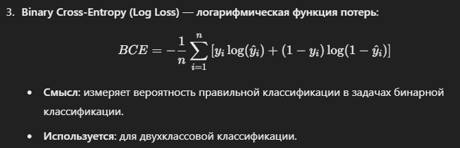
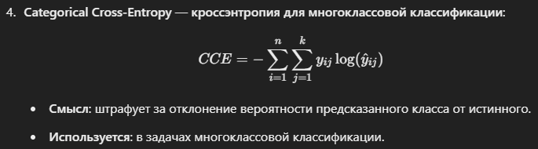
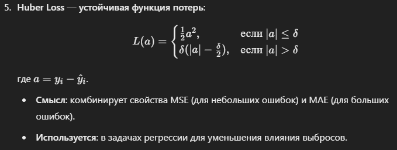

### Loss-функция. Определение. Смысл. Примеры простейших loss-функций и их смысл

`Определение`. Loss-функция (или функция потерь) — это математическая функция, которая измеряет расхождение между предсказанными моделью значениями и истинными (целевыми) значениями.

`Смысл`. Loss-функция используется для оценки качества модели. Чем меньше значение функции потерь, тем лучше модель справляется с задачей. Основная цель обучения модели — минимизация функции потерь, что позволяет улучшить точность предсказаний.

`Примеры простейших loss-функций и их смысл`

