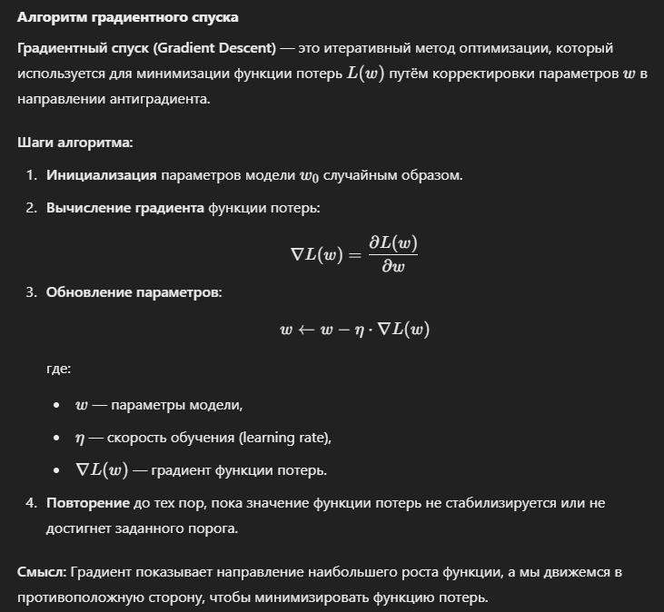
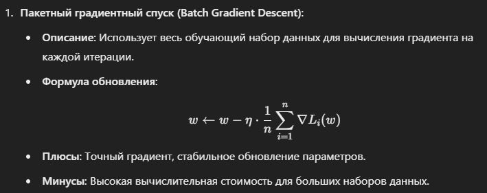
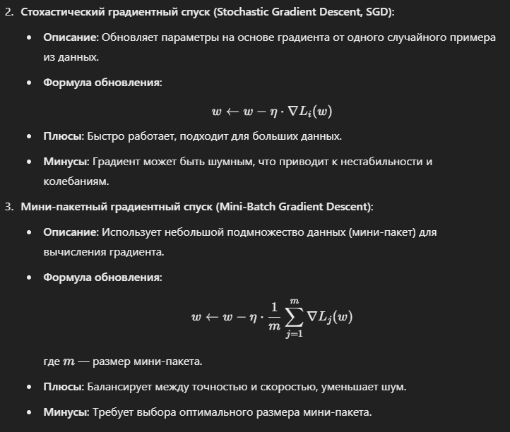

### Обучение модели машинного обучения. Алгоритм градиентного спуска. Стохастический градиентный спуск. Пакетный градиентный спуск. 

`Обучение модели машинного обучения`. Обучение модели — это процесс оптимизации её параметров (весов) с целью минимизации функции потерь на обучающем наборе данных. Основной задачей является нахождение таких параметров, при которых модель лучше всего предсказывает целевые значения.

`Алгоритм градиентного спуска`. Градиентный спуск (Gradient Descent) — это итеративный метод оптимизации, который используется для минимизации функции потерь 𝐿(𝑤) путём корректировки параметров 𝑤 в направлении антиградиента.

`Варианты градиентного спуска`

`Заключение`. Градиентный спуск и его варианты являются основой обучения моделей машинного обучения. Выбор подходящего варианта зависит от объёма данных, вычислительных возможностей и требований к точности. Для больших данных обычно используется стохастический или мини-пакетный градиентный спуск.
